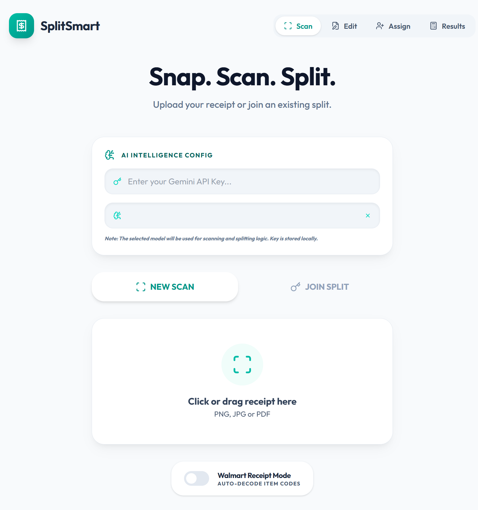
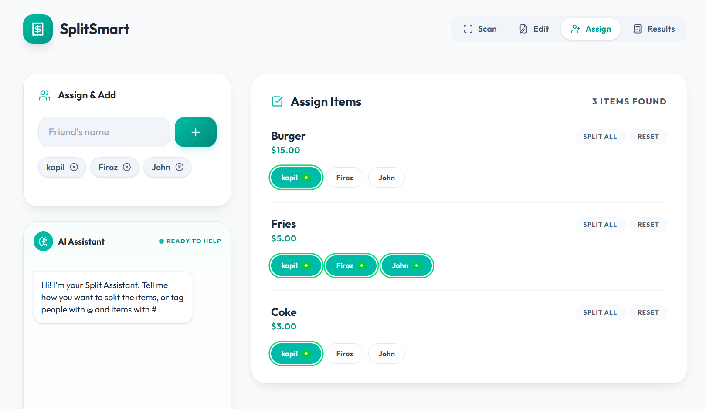
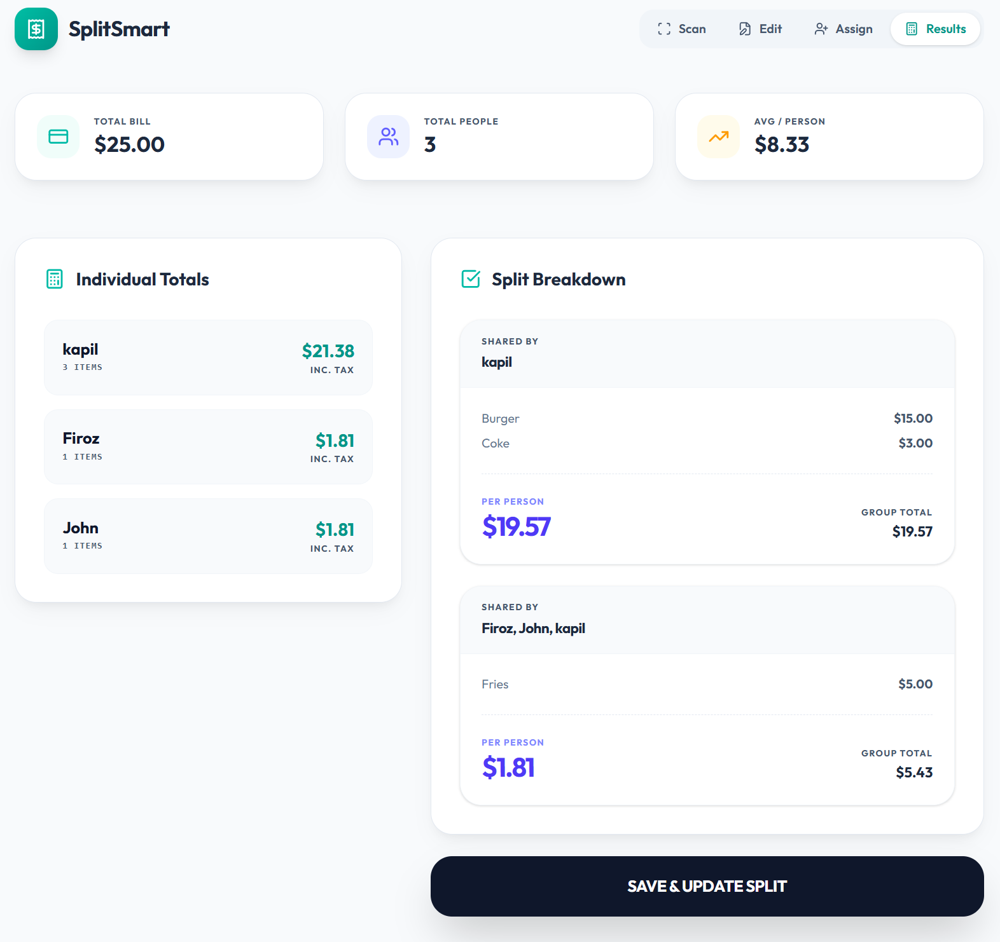
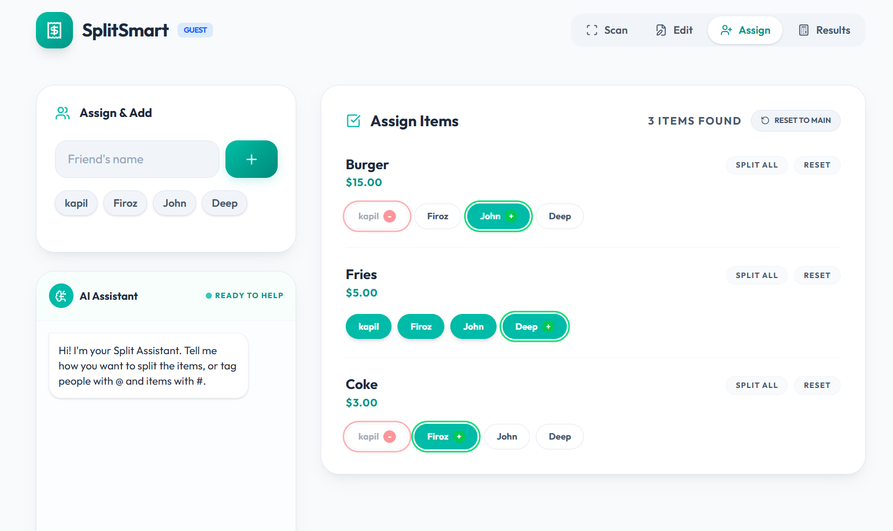
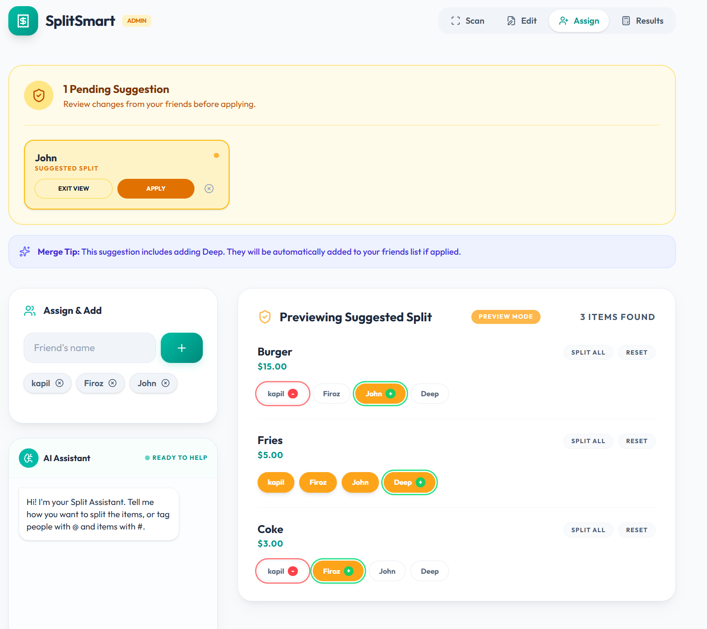

# SplitSmart AI 🧾✨

SplitSmart AI is a premium, AI-powered receipt scanning and bill-splitting application. It uses Google's Gemini models to intelligently extract items from receipts, decode abbreviated retailer codes, and help friends split costs with natural language instructions.

[](https://splitsmart-ai.web.app)
[](https://deepmind.google/technologies/gemini/)
[](https://reactjs.org/)

---

## 📱 App Walkthrough

### 1. Smart Landing Page
The gateway to quick scanning and secure collaboration.



### 2. Visual Item Assignment
The core splitting engine where items find their owners.


### 3. Itemized Results
Professional breakdown of shares and totals with tax calculation.


### 4. Share with friends and let them suggest changes
Allow your friends to suggest modifications to their/other members contribution


### 5. Admin Review & Approval
Merge suggestions from friends with one click.



---

## 🚀 Key Features

### 1. AI-Powered Receipt Scanning 📸
- **Intelligent Extraction**: Snap a photo and let AI extract item names, prices, tax, and totals automatically.
- **Retailer Decoding**: Specialized mode for retailers like Walmart to decode cryptic codes (e.g., `GV WHOLE GAL` → `Great Value Whole Milk Gallon`).
- **Bring Your Own Key (BYOK)**: Fully private. Use your own Gemini API key stored securely in your browser's local storage.

### 2. Natural Language Splitting 💬
- **Text-to-Split**: Instead of manual checkboxes, just type: *"@Alice and @Bob share the Pizza"* or *"@Charlie doesn't share the drinks"*.
- **Mention System**: Support for `@` targeting people and `#` targeting specific receipt items.
- **Dynamic Assignments**: AI updates the bill distribution in real-time based on your instructions.

### 3. Real-Time Collaboration 🤝
- **Cloud Sync**: Powered by Supabase for instant persistence.
- **Guest Suggestions**: Friends can join a split via a unique ID and password to suggest their own item assignments.
- **Admin Approval**: The split creator reviews and approves suggestions with a single click.

### 4. Premium User Interface 🎨
- **Modern Aesthetics**: Sleek dark/light mode with glassmorphism and smooth Framer Motion animations.
- **Responsive Design**: Works perfectly on mobile and desktop.
- **Interactive Results**: Clear breakdown of "Who owes What" with itemized summaries.

---

## 🛠️ tech Stack

- **Frontend**: React 19, Vite, Tailwind CSS 4.0
- **AI**: Google Generative AI (Gemini Flash & Pro)
- **Database/Storage**: Supabase (PostgreSQL)
- **Hosting**: Firebase Hosting
- **Animations**: Framer Motion
- **Icons**: Lucide React

---

## 🏁 Getting Started

### Prerequisites
- Node.js (v18+)
- A Supabase Project
- A Gemini API Key (from [Google AI Studio](https://aistudio.google.com/))

### Installation

1. **Clone the repository**
   ```bash
   git clone https://github.com/your-username/splitsmart-ai.git
   cd splitsmart-ai
   ```

2. **Install dependencies**
   ```bash
   npm install
   ```

3. **Environment Setup**
   Create a `.env` file in the root:
   ```env
   VITE_SUPABASE_URL=your_supabase_url
   VITE_SUPABASE_ANON_KEY=your_supabase_anon_key
   ```

4. **Database Setup**
   Run the SQL provided in `supabase_setup.sql` in your Supabase SQL Editor to create the necessary tables and RLS policies.

5. **Run Locally**
   ```bash
   npm run dev
   ```

---

## 🔒 Privacy & Security

SplitSmart AI is designed with privacy in mind:
- **No API Keys Stored**: Your Gemini API Key is stored only in your local browser storage (`localStorage`). It never hits our database.
- **Password Protection**: Every split is protected by an Admin and View-only password.
- **RLS Policies**: Row Level Security ensures users can only access splits they have the credentials for.

---

## 📄 License

Distributed under the MIT License. See `LICENSE` for more information.

---

## 👨‍💻 Contributing

Contributions are what make the open-source community such an amazing place to learn, inspire, and create. Any contributions you make are **greatly appreciated**.

1. Fork the Project
2. Create your Feature Branch (`git checkout -b feature/AmazingFeature`)
3. Commit your Changes (`git commit -m 'Add some AmazingFeature'`)
4. Push to the Branch (`git push origin feature/AmazingFeature`)
5. Open a Pull Request
